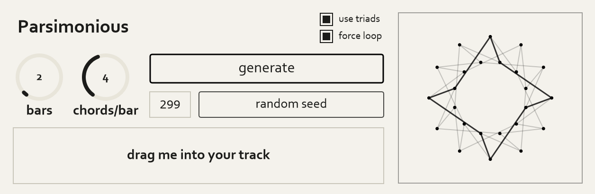

# Parsimonious

### A New Way to Generate Chord Progressions

## Project Overview

Parsimonious is a VST3 plugin for generating mathematically smooth 
MIDI chord progressions. Parsimonious differs from other chord generator plugins,
by forcing each sequence of chords to only move a
single voice at a time. This maintains elegant voice leading, but doesn't produce progressions
that fit cleanly into tonal centers. The result is a dreamy, trance like sequence of harmony.

> **Here's an example:**
>
> C7 -> Cmin7 -> A&oslash;7 -> Abmaj7
>
> Despite not fitting into a specific key, this progression sounds smooth because each chord shares 3 pitches with it's neighbor(s).

In music theory, we often define music as a dichotomy between tonal and atonal music. This is quite reductive, and leaves out a lot of amazing music that doesn't quite fit into either category. Parsimonious voice leading fits firmly in the center of that divide. These progressions don't have strong tonic/dominant functions, but still maintain a level of stability if you don't want to jump into the deep end of post tonal set theory or serialism. This offers voice leading offers a middle ground between tonal and atonal harmony for music that doesn't cleanly fit into either category.

*Much of the work for this plugin was made possible by a [paper](https://archive.bridgesmathart.org/2018/bridges2018-301.pdf)
published by Sonia Cannas and Moreno Andreatta, who expanded traditional neo-Riemannian transformations beyond just triads.*

## Features

- VST3 compatible with all standard DAWs
- Compatible with MuseScore 4
- Users can generate, then drag and drop a MIDI file directly into their project
- Generates 7th chord progressions (major7, minor7, dominant7, half diminished7 and fully diminished7)
- Optionally generates triads using classic P, L, R transformations
- Users can specify the length of the progression and the number of chords per bar
- Users can force the progression to loop, guaranteeing the first and last chords share three pitches
- Progressions are generated randomly, users can specify a seed
- Users can view progressions on a generated graph of nodes and edges

## Challenges I Overcame

1) **Forced Loops:** When generating progressions that aren't loops, we can simply take a 
randomized walk through the graph with length equalling the number of chords requested. However
forcing the progression to loop is much harder. Brute force recursive solutions are obviously 
too costly, so instead I used a dynamic programming approach. Before walking through the graph,
we precompute a table of each chord's distance to the starting chord, allowing us to only explore
options that will lead to a cycle of the correct length.

2) **Triad Loops of Odd Length:** an interesting property of the tonnetz is that it's a bipartite
graph. When applying transformations, we always alternate from major to minor. As a result, loops
of odd length are impossible. To avoid this issue, if the user attempts to generate a loop of triads
with an odd length, the plugin catches it and sends a warning to the user.

## Tech Stack

- JUCE 
- C++
- CMake